# Descrição

<!-- badges: start -->

[](https://www.tidyverse.org/lifecycle/#experimental)
<!-- badges: end -->

NIRtools foi desenhado para auxiliar taxonomistas e ecólogos de plantas
em **documentar** e **construir** subconjuntos de dados do infravermelho
próximo (NIR, do inglês *Near infrared spectroscopy*), por meio do usos
de arquivos de parâmetros que servirão como metadados de cada
subconjunto. Também estão inclusas funções para auxiliar a plotar os
resultados. O pacote foi criado inicialmente para lidar com leituras
obtidas de um espectrofotômetro Thermo Nicollet (Thermo Fischer
Scientific, Waltham, Massachusetts, USA), modelo Antaris II FT-NIR
Analyzer, hospedado no herbário do INPA, Amazonas, Brasil.

# Contribuições e relatos de problemas

Caso haja o desejo de contribuir para o desenvolvimento do pacote, ou se
verifique algum erro na instalação, no uso de alguma função, abra um
problema na seção `Issues` do GitHub e dê um alô:
<https://github.com/ricoperdiz/NIRtools/issues>.

**Problemas/Issues**: <https://github.com/ricoperdiz/NIRtools/issues>.

<!-- NIRtools was specifically designed to help plant taxonomist and ecologists in documenting and building near infrared (NIR) spectroscopy subsets from a dataset based on parameter files that will serve as a metadata of each subset.-->
<!-- # O que é o NIR? -->
<!-- Para mais detalhes, [leia este trabalho](http://www.scielo.br/scielo.php?script=sci_arttext&pid=S0103-50532003000200006). -->

# Instalação

Você pode instalar esta versão em desenvolvimento por meio do pacote
`remotes`.

    install.packages("remotes")
    library(remotes)
    remotes::install_github("ricoperdiz/NIRtools")

Após instalar o NIRtools, digite o comando abaixo para ver o arquivo
contendo o tutorial do pacote.

<!--After installing NIRtools, type the command below to see the vignette with NIRtools tutorial.-->

    vignette("NIRtools_tutorial", package = "NIRtools")

# Como usar?

Primeiro, carregue o pacote:

``` r
library("NIRtools")
```

Vamos trabalhar com o conjunto de dados que vem com o pacote, chamado
`nir_data`. Após o carregamento do pacote, ele ficará disponível. Ele
consiste em um arquivo com 48 linhas e 1562 colunas e é uma pequena
porção de um conjunto de dados muito maior utilizado na minha tese
(Perdiz 2020), que abrange dados NIR extraídos de espécimes do complexo
de espécies *Protium aracouchini* (Aubl.) Marchand, um grupo de árvores
pertencentes à família Burseraceae e de distribuição Neotropical.

``` r
dim(nir_data)
#> [1]   48 1562
```

As cinco primeiras colunas correspondem aos identificadores dos dados:

-   `especimenid` - identificador numérico do espécime dentro da base de
    dados `DuckeWiki`, onde estoco todos os dados de minha tese.
    Trata-se da coluna identificadora da amostra.
-   `SP1` - nome da espécie. Aqui pode haver epítetos específicos, nomes
    de espécies, nomes de morfotipos etc;
-   `face` - face do folíolo que foi extraída a leitura NIR. Este
    conjunto de dados é proveniente de plantas com flores, logo,
    utilizamos faces das folhas/folíolos para obter as leituras.
-   `coletor` - nome do coletor da amostra.
-   `number` - número de coleta da amostra.

``` r
names(nir_data)[1:5]
#> [1] "especimenid" "SP1"         "face"        "coletor"     "number"
```

Abaixo, vemos as primeiras seis linhas e dez colunas dos dados:

``` r
head(nir_data)[, 1:10]
#>    especimenid            SP1    face      coletor number X10001.03  X3999.64
#> 1:       10194 P. aracouchini abaxial Perdiz, R.O.   2856 0.2776265 0.5961316
#> 2:       10194 P. aracouchini adaxial Perdiz, R.O.   2856 0.2542301 0.5672824
#> 3:       10194 P. aracouchini abaxial Perdiz, R.O.   2856 0.2730012 0.5813973
#> 4:       10194 P. aracouchini adaxial Perdiz, R.O.   2856 0.2582242 0.5764732
#> 5:       10194 P. aracouchini abaxial Perdiz, R.O.   2856 0.2776265 0.5961316
#> 6:       10194 P. aracouchini adaxial Perdiz, R.O.   2856 0.2542301 0.5672824
#>    X4003.497 X4007.354 X4011.211
#> 1: 0.5964082 0.5962480 0.5961008
#> 2: 0.5674334 0.5673867 0.5674006
#> 3: 0.5817484 0.5816703 0.5815431
#> 4: 0.5767084 0.5766730 0.5765890
#> 5: 0.5964082 0.5962480 0.5961008
#> 6: 0.5674334 0.5673867 0.5674006
```

As colunas que começam *X* correspondem aos espectros NIR.

## Metadados

É comum durante as análises de dados NIR criarmos vários subconjuntos de
dados. Para facilitar o processo de arquivamento de cada subconjunto de
dados, criei uma função para auxiliar no processo de criação de
metadados que descrevam cada um dos subconjuntos.

O metadado é um arquivo de texto em que estão especificados todos os
parâmetros para se criar um subconjunto de dados NIR. Para isso, fazemos
uso da função `write_NIRparams`.

Neste exemplo, meu subconjunto se chamará `conjunto1`, eu utilizarei a
*MÉDIA* das leituras (argumento `mean`no parâmetro **reads**) e apenas a
face *abaxial* (argumento `abaxial` no parâmetro **surface**) das
folhas. Também informo qual o nome da coluna para reconhecer a amostra
(argumento `especimenid` no parâmetro **individual\_id**) e o táxon
(argumento `SP1` no parâmetro **group\_id**).

``` r
write_NIRparams(
  file = "conjunto1",
  wd = ".",
  reads = "mean",
  surface = "abaxial",
  nir_variables = "all",
  surface_id = "face",
  individual_id = "especimenid",
  group_id = "SP1",
  nir_id = "X"
)
```

Ao executar a função, uma messagem aparece confirmando a ação e
informando onde o arquivo foi salvo.

Vamos ver este arquivo:

``` r
readLines("test-NIRparams.txt")
```

    #>  [1] "# NIR dataset description - Dataset name and variables for its construction"                                                                             
    #>  [2] "conjunto1 ## [dataset_name]: Dataset name."                                                                                                              
    #>  [3] "inst/extdata ## [working_dir]: Location of working directory. If not provided, current working directory will be used one"                               
    #>  [4] "abaxial ## [surface]: Which leaf surface (abaxial, adaxial, both)"                                                                                       
    #>  [5] "mean ## [reads]: Do all the reads will be taken into account (all, mean)?"                                                                               
    #>  [6] "all ## [nir_variables]: Which NIR variables will be used (all, subset)"                                                                                  
    #>  [7] "           ## [subset_file]: Location of NIR variable subset file, in case option selected in `nir_variables` was `subset`"                              
    #>  [8] "especimenid ## [individual_id]: Which variable name corresponds to the individual?"                                                                      
    #>  [9] "           ## [individual_list]: Location of a file containing list of specimens to subset data when building datasets with `build_NIRdataset` function."
    #> [10] "face ## [surface_id]: Which variable name corresponds to the leaf surface?"                                                                              
    #> [11] "SP1 ## [group_id]: Which name corresponds to the group category?"                                                                                        
    #> [12] "X ## [nir_id]: A string that can be used to grep column names containing NIR data. Default value is '`X`, which precedes all columns with NIR data."

Após a criação do arquivo, você pode visualizar as informações deste
metadado em um `data.frame` utilizando a função `read_NIRparams()`.

``` r
read_NIRparams(arq = "conjunto1-NIRparams.txt")
```

    #>    dataset_index dataset_name group_id individual_id individual_list nir_id
    #> 1:             1    conjunto1      SP1   especimenid                      X
    #>    nir_variables reads subset_file surface surface_id  working_dir
    #> 1:           all  mean             abaxial       face inst/extdata

Tendo um arquivo de metadado pronto, podemos utilizá-lo para construir
subconjuntos de dados com a função `build_NIRdataset()`. Vamos utilizar
nosso conjunto `nir_data` nesta ação e atribuir o subconjunto ao objeto
`subset01`:

``` r
subset01 <- build_NIRdataset(dframe = nir_data, params_file_path = "test-NIRparams.txt", save_txt = TRUE, save_RDS = FALSE)
```

Você pode também salvar o conjunto de dados como um arquivo `.RDS`,
bastando alterar o argumento `save_RDS = FALSE` para `save_RDS = TRUE`.

Vamos checar nosso subconjunto `subset01`:

``` r
head(subset01)[, 1:10]
#>    especimenid            SP1 X10001.03  X3999.64 X4003.497 X4007.354 X4011.211
#> 1:       10194 P. aracouchini 0.2753139 0.5887644 0.5890783 0.5889591 0.5888220
#> 2:       10196 P. aracouchini 0.2749816 0.6923077 0.6922057 0.6917682 0.6912639
#> 3:       10197 P. aracouchini 0.2733511 0.6746285 0.6747441 0.6746230 0.6742794
#> 4:       12647   P. calanense 0.3311255 0.7202857 0.7205464 0.7204470 0.7201952
#> 5:       12648   P. calanense 0.4101432 0.7467227 0.7471405 0.7470607 0.7470689
#> 6:       12650   P. calanense 0.3457028 0.7229991 0.7234671 0.7235295 0.7234836
#>    X4015.068 X4018.925 X4022.781
#> 1: 0.5883515 0.5874672 0.5861983
#> 2: 0.6904556 0.6891801 0.6876332
#> 3: 0.6734916 0.6723469 0.6707479
#> 4: 0.7194824 0.7183890 0.7167415
#> 5: 0.7465844 0.7457219 0.7442728
#> 6: 0.7228718 0.7219306 0.7205142
```

## Construção de subconjuntos de dados NIR

Já demonstramos o uso da função `build_NIRdataset()` para construir
subconjuntos de dados NIR. Vou dar outro exemplo.

Vamos fazer um novo subconjunto, desta vez utilizando ambas as faces
(argumento `both` no parâmetro **surface**).

``` r
write_NIRparams(
  file = "conjunto2",
  wd = ".",
  reads = "mean",
  surface = "both",
  nir_variables = "all",
  surface_id = "face",
  individual_id = "especimenid",
  group_id = "SP1",
  nir_id = "X"
)
```

``` r
subset02 <- build_NIRdataset(dframe = nir_data, params_file_path = 'conjunto2-NIRparams.txt', save_txt = FALSE, save_RDS = FALSE)
```

``` r
head(subset02)[, 1:10]
#>    especimenid            SP1 X10001.03  X3999.64 X4003.497 X4007.354 X4011.211
#> 1:       10194 P. aracouchini 0.2657705 0.5803211 0.5805746 0.5804945 0.5804084
#> 2:       10196 P. aracouchini 0.2736647 0.6922972 0.6921306 0.6916431 0.6910621
#> 3:       10197 P. aracouchini 0.2739116 0.6801971 0.6802206 0.6799290 0.6795169
#> 4:       12647   P. calanense 0.3277592 0.7225972 0.7229013 0.7228144 0.7225778
#> 5:       12648   P. calanense 0.3929228 0.7438272 0.7442128 0.7442216 0.7442072
#> 6:       12650   P. calanense 0.3473396 0.7405394 0.7410842 0.7411734 0.7411214
#>    X4015.068 X4018.925 X4022.781
#> 1: 0.5799928 0.5791540 0.5778621
#> 2: 0.6902488 0.6890739 0.6874375
#> 3: 0.6787094 0.6775456 0.6760225
#> 4: 0.7218783 0.7208041 0.7191810
#> 5: 0.7436983 0.7428911 0.7414960
#> 6: 0.7405892 0.7396831 0.7381997
```

## Plotar gráficos

Criei uma função para facilitar a criação de gráficos com os espectros
NIR. Vamos utilizar novamente o conjunto `nir_data` como demonstração.

Primeiramente, precisamos converter os dados para um objeto de classe
`nirdf`. Esta classe foi criada neste pacote e visa facilitar a produção
de gráficos de espectros mais facilmente. Para converter um conjunto de
dados NIR em um objeto de classe `nirdf`, são necessários itens:

1.  Especificar a variável que contem a nossa categoria de interesse no
    gráfico. Neste caso, a nossa variável de interesse se chama `SP1` e
    corresponde a uma coluna do objeto `nir_data`. Esta informação deve
    ser informada no argumento `category`.
2.  Informar quais colunas possuem as variáveis NIR. Em nosso objeto
    `nir_data`, as variáveis NIR possuem a letra *X* precedendo cada
    variável NIR. Esta informação deve ser colocada no argumento
    `measure_columns`.

``` r
nirdad <- nirdf(nir_data, category = "SP1", measure_columns = grep("^X", names(nir_data), value = TRUE), measure_columns_prefix = "X")
#> 
#> Removing measurement column prefix: X
#> 
#> Returning a nirdf object.
```

Ao executar esta ação, obtemos um objeto de classe `nirdf`:

``` r
class(nirdad)
#> [1] "nirdf"      "data.table" "data.frame"
```

Em seguida, basta usar a função `plot()` informando no argumento
`category` o nome da coluna contendo a categoria de interesse. Neste
caso, trata-se da variável `SP1`

``` r
plot(nirdad, "SP1")
```


Incluí alguns argumentos novos para facilitar a mudança de alguns
parâmetros gráficos.

## Mudar o título dos eixos x e y

``` r
plot(nirdad, "SP1", xlabel ="Meu eixo X",
  ylabel = "Meu eixo Y")
```

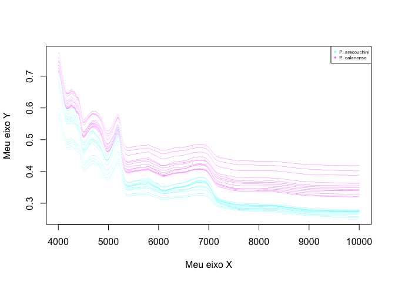

## Mudar a posição da legenda

``` r
plot(nirdad, "SP1", legend_position = "topright")
```


``` r
plot(nirdad, "SP1", legend_position = "topleft")
```

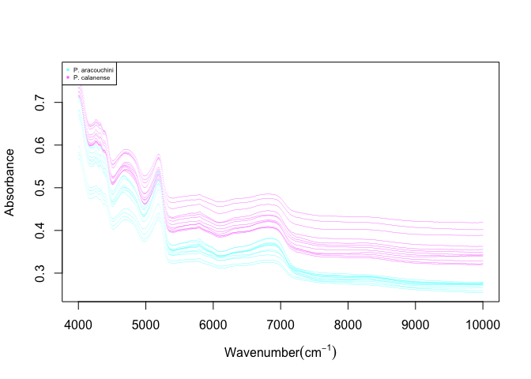

``` r
plot(nirdad, "SP1", legend_position = "bottomright")
```

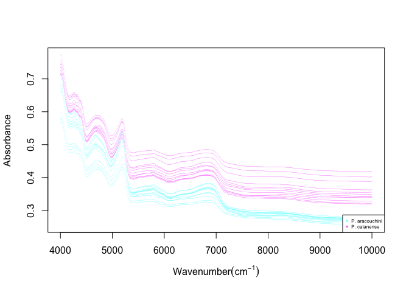

``` r
plot(nirdad, "SP1", legend_position = "bottomleft")
```

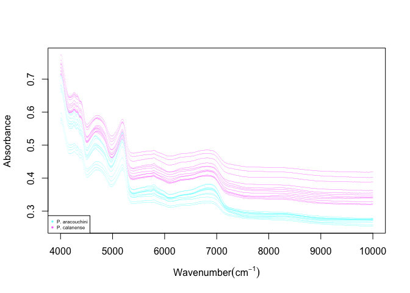

## Mudar a grossura das linhas espectrais

``` r
plot(nirdad, "SP1", cex_pt = 0.08)
```

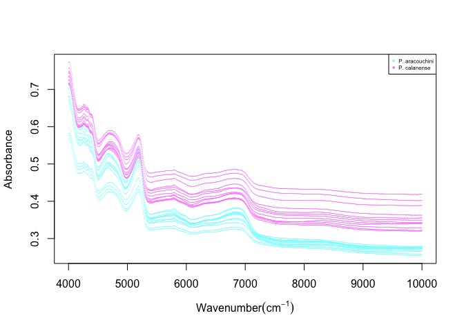

``` r
plot(nirdad, "SP1", cex_pt = 0.14)
```

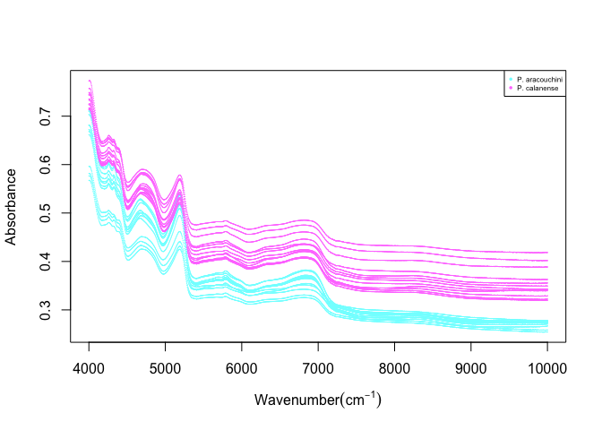

## Mudar o tamanho da legenda

``` r
plot(nirdad, "SP1", cex_leg = 0.6)
```


``` r
plot(nirdad, "SP1", cex_leg = 0.9)
```

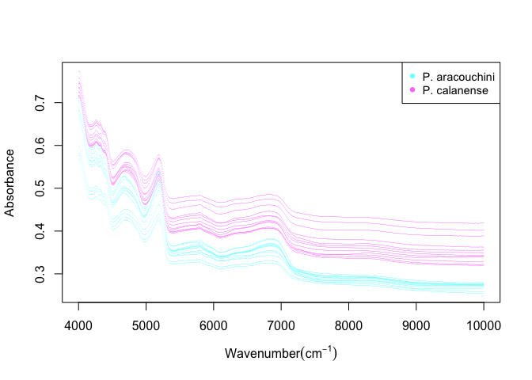

## Mudar a fonte da legenda

``` r
plot(nirdad, "SP1", text_font = 1)
```

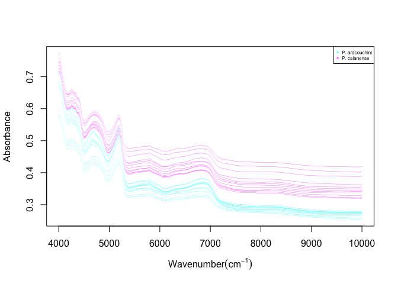

``` r
plot(nirdad, "SP1", text_font = 2)
```

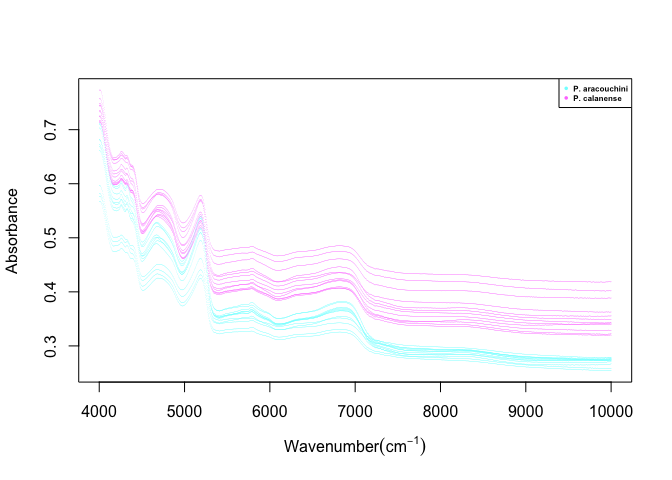

``` r
plot(nirdad, "SP1", text_font = 3)
```


## Alterar a cor das linhas espectrais

``` r
plot(nirdad, "SP1", color = c("green", "red"))
```

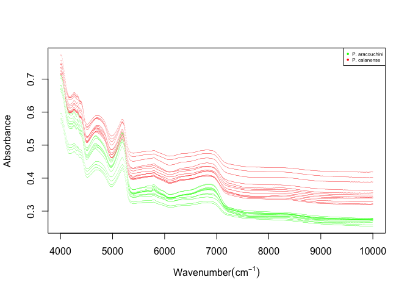

## Incluir ou não a legenda

``` r
plot(nirdad, "SP1", plot_legend = TRUE)
```


``` r
plot(nirdad, "SP1", plot_legend = FALSE)
```

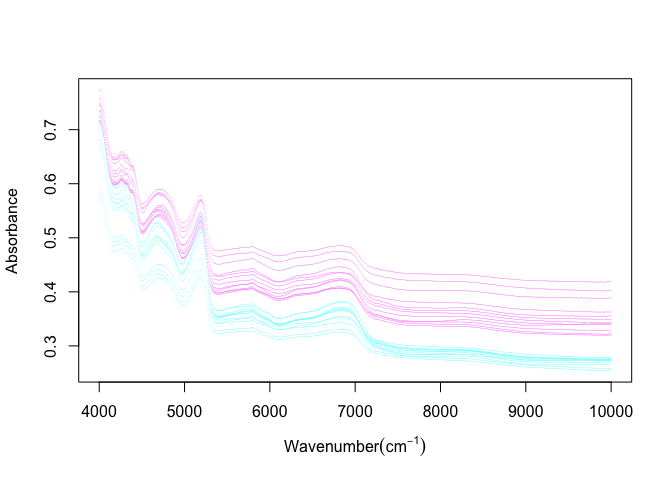

# Aplicativo Shiny

Está em processo de construção um aplicativo
[Shiny](https://shiny.rstudio.com/gallery/) para auxiliar no processo de
importação e visualização dos dados NIR.

No momento, o aplicativo está funcionando, porém ainda não aceita dados
do usuários. Como uma maneira de demonstração, sugiro a você usuário
testar o aplicativo e em caso de sugestões, abrir um problema na seção
[Issues](https://github.com/ricoperdiz/NIRtools/issues) relatando sua
experiência e sugestões de melhora no aplicativo.

A idéia é permitir que o usuário carregue seus dados, possa executar
análises, checar espectros e salvá-los, dando a possibilidade de alterar
argumentos em todos os passos.

## Demonstração

Instale os pacotes abaixo:

``` r
install.packages(c("shiny", "DT", "RColorBrewer"), dependencies = TRUE)
```

Agora, execute os comandos abaixo:

``` r
library("NIRtools")
meuaplicativo()
```

Por enquanto, o aplicativo só permite visualizar algumas variáveis do
conjunto de dados `nir_data` utilizado nos exemplos anteriores.

Em breve, teremos novas funcionalidades. Aguarde!

# Referências

<div id="refs" class="references csl-bib-body hanging-indent">

<div id="ref-Perdiz2020" class="csl-entry">

Perdiz, R. O. 2020. “<span class="nocase">Delimitação específica e
filogeografia do complexo *Protium aracouchini* (Aubl.) Marchand
(Burseraceae)</span>.” PhD thesis, Programa de pós-graduação em Ciências
Biológicas (Botânica), Instituto Nacional de Pesquisas da Amazônia.

</div>

</div>
